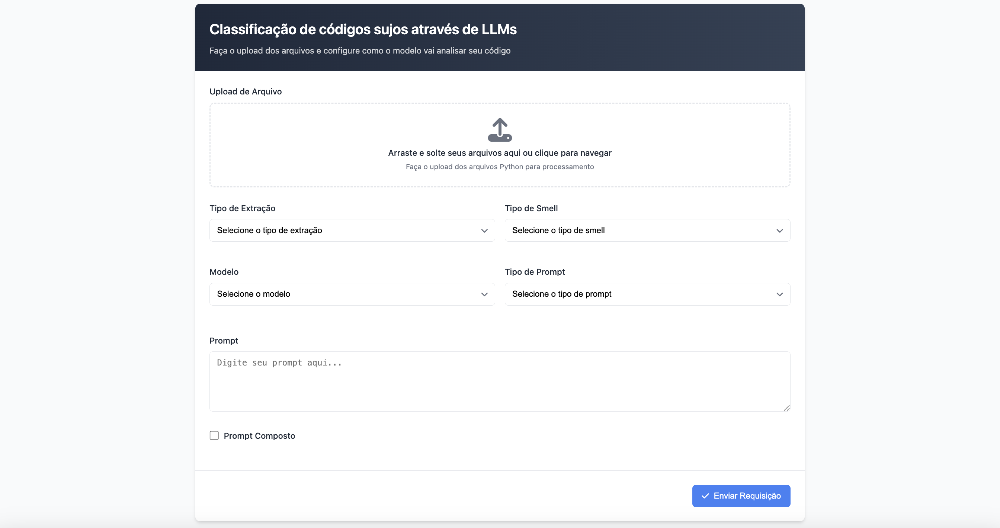

<div align="center" >
    
    </br>
    <h3>Code Smell Analysis</h3>
</div>

This application was developed as an interface for users to classify code snippets with possible code smells.

# Built with
* HTML
* CSS
* JavaScript

# How to run?

* 1 - Open ```index.html``` in your browser.


# Dependencies

* ml4smells-code-extractor.API


