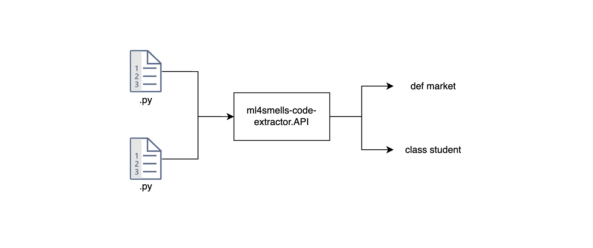

<div align="center" >
    
    </br>
    <h3>Code extractor API</h3>
</div>


This application was developed to extract code structures, such as classes and methods, from the analysis of the Abstract Syntax Tree (AST)


# Built with
* [Python 3.10](https://www.python.org/downloads/release/python-3100/)
* [RabbitMq](https://www.rabbitmq.com/)


# Project Structure

```
├──📁 ml4smells-code-extractor.API
│   ├──📁 docs
│   ├──📁 src
│   |   ├──📁 app
│   |   |   ├──📁 application
│   |   |   └──📁 infrastucture
│   ├──📄 changelog
│   ├──📄 .gitignore

```

# How to run?

* 1 - Make sure you are in the `app` folder
* 2 - Run: `pip install -r requirements.txt`
* 3 - Create: `.env`
* 4 - Set up [RabbitMQ](https://www.rabbitmq.com/docs/download) according to the `.env` file
* 5 - Run: `fastapi dev main.py`
* 6 - Host: `http://localhost:8000/docs`


# Dependencies

* RabbitMq
* ml4smells-llm-integrator